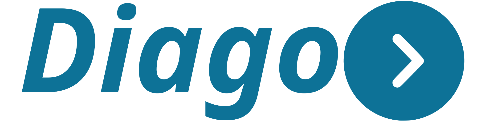

[](https://goreportcard.com/report/github.com/emiago/diago)


Short of **dialog + GO**.  
**Library for building VOIP solutions in GO!**

Built on top of optimized [SIPgo library]((https://emiago.github.io/diago))!  
In short it allows developing fast and easy testable VOIP apps to handle calls, registrations and more... 

*Diago is mainly project driven lib, so lot of API design will/should be challenged with real working apps needs*

**For more information and documentation visit [the website](https://emiago.github.io/diago/docs)**

Quick links:
- [Getting started](https://emiago.github.io/diago/docs/getting_started/)
- [Demo Examples](https://emiago.github.io/diago/docs/examples/)
- [API Docs](https://emiago.github.io/diago/docs/api_docs/)
- [GO Docs](https://pkg.go.dev/github.com/emiago/diago)
- [Roadmap](https://emiago.github.io/diago/docs/#core-roadmap)

*If you find this project useful and you want to support/sponzor or need help with your projects, you can contact me more on*
[mail](mailto:emirfreelance91@gmail.com).

Follow me on [X/Twitter](https://twitter.com/emiago123) for regular updates

**Tools/Service developed with diago:**
-  [github.com/emiago/diagox](https://github.com/emiago/diagox) simple Ingress/Egress and Registrar for SIP/RTP scaling
-  [github.com/emiago/gophone](https://github.com/emiago/gophone) CLI softphone for easy testing 

## RFCS

SIP: [RFC 3261](https://datatracker.ietf.org/doc/html/rfc3261)|[RFC3581](https://datatracker.ietf.org/doc/html/rfc3581)|[RFC6026](https://datatracker.ietf.org/doc/html/rfc6026)
> More refer to lib [github.com/emiago/sipgo](https://github.com/emiago/sipgo)
Full dialog control (client/server), Registering, Authentication ...

SDP: [RFC8866](https://datatracker.ietf.org/doc/html/rfc8866). 
> Parsing + Auto Generating for media session/audio

RTP/AVP: 
[RFC3550](https://datatracker.ietf.org/doc/html/rfc3550)
> RTP Packetizers, Media Forking, RTP Session control, RTCP Sender/Receiver reports, RTCP statistics tracking, DTMF reader/writer ...

NOTE: For specifics and questions what is covered by RFC, please open Issue. Note lot of functionality can be extended even if not built in library. 

## Contributions

Please avoid following:
- Creating BIG PR that creates feature or lot of refactoring without previously having Issue that explains problem with discussion more about requirements
- Creating Change Log or some other textual files that add some sort of documentation. This is why we need Issue and ID issue should be in your commit. If you want(think it is good) to have this better documented(like webpage or readme) pls open issue. Lot of is highlighted on releases so if change is big it will probably be highlighted.
- English is main language for code and for comments. Any other language used in any commit will be rejected.

Library is under development and could not have latest code pushed. Having small PR that fixes issue are fine but not for more complex problem

## Usage 

Checkout more on [Getting started](https://emiago.github.io/diago/docs/getting_started/), but for quick view here is echotest (hello world) example.
```go 
ua, _ := sipgo.NewUA()
dg := diago.NewDiago(ua)

dg.Serve(ctx, func(inDialog *diago.DialogServerSession) {
	inDialog.Trying() // Progress -> 100 Trying
	inDialog.Answer(); // Answer

	// Make sure file below exists in work dir
	playfile, err := os.Open("demo-echotest.wav")
	if err != nil {
		fmt.Println("Failed to open file", err)
		return
	}
	defer playfile.Close()

	// Create playback and play file.
	pb, _ := inDialog.PlaybackCreate()
	if err := pb.Play(playfile, "audio/wav"); err != nil {
		fmt.Println("Playing failed", err)
	}
}
```

See more [examples in this repo](/examples)
### Tracing SIP, RTP

While openning issue, consider having some traces enabled.

```go
sip.SIPDebug = true // Enables SIP tracing
media.RTCPDebug = true // Enables RTCP tracing
media.RTPDebug = true // Enables RTP tracing. NOTE: It will dump every RTP Packet
```
