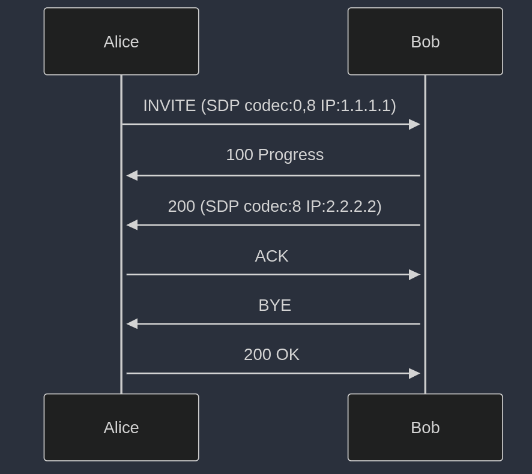

## Undestanding SIP and media

INVITE carries **SDP** (application/sdp) in body of message as **offer** to explain media capabilites and connection setup. INVITE can have any other type in Body like HTTP, but SDP protocol is mainly used. More about this later. 

Accepting(Answering) call is done by respondin with **200 OK**  
Response carries **SDP** in body as **answer** to explain callee's media capabilites and connection. 

### Call with media

With SDP we explain our capabilites and protocol used for media and this mostly boils down to this 3 things:
1. explaining which codecs are supported for decoding (alaw,ulaw, opus, g722, ...), 
1. protocol and profile (RTP AVP). RTP can have different profile but AVP (Audio Video) is used in this case
1. and Listen IP where we expect incoming media (UDP)

#### Returning 200

For realtime media RTP is one mostly used. Anyway in case Bob has no similar capabilities, lets say codecs, Bob will send non 200 response and call will be terminated.

#### Sending ACK

After Caller receiving 200 OK it is required that Caller acknowledge Callee capabilities, by sending ACK (non transactional, no response) request.

### Codecs

Codecs or in other words **Formats** are identified as numbers. There are static defined by AVP profile or user can have any other defined with own custom numbers. In above case we use statically defined.
- 0 ulaw 8000Hz
- 8 alaw 8000Hz

In SDP this will be shown as **m=desc** key. Ex:  
`m=audio 49170 RTP/AVP 0 8`  
Description:
- audio: type of stream
- 49170: port on which is listening
- RTP/AVP: identifier for RTP protocol and AVP denotes as Audio Video
- 0: is codec identifier

Normally this should be followed with `a=rtpmap` attributes to explain about codecs. In case static this is not required.

### Listen IP

Information and where device/use is listening for incoming media traffic
`c=IN IP4 198.51.100.1`
- IP4 denotes IP version 4 is used

With nowdays NAT this unfortunatelly makes problem, as you can expect end user behind NAT will publish his private IP like `192.168.1.1`. This is solved in different ways, but for now we will stop here. 
Other problem is if call is jumping between media servers, above can be changed with new IP received via new INVITE messaging.

**NOTE**:
Publishing local IP like above is problem for NAT and there different approaches to solve this issue, but for now we will skip this part.