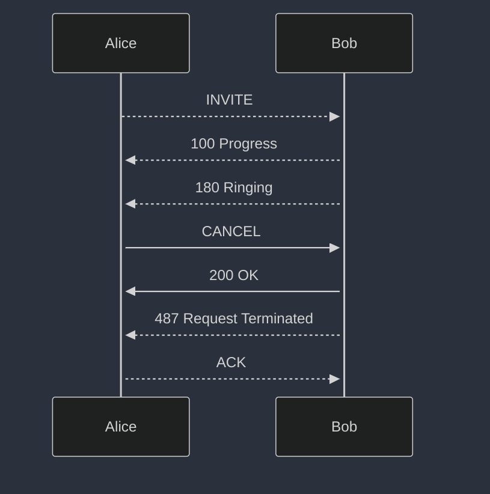

Every call starts with **INVITE** SIP Messages. Here is how to relate SIP message to PHONE actions
- Dialing = INVITE
-  Answer = 200 OK response on INVITE
-  Hangup = BYE 
-  Cancel = CANCEL
- Reject = 486 Busy


INVITE is creating **session** which we call **dialog**.  


*Caller (Client)*: Sends one time ACK as confirmation

### Succesfull call


Example of `alice` inviting `bob`
```bash
INVITE sip:bob@127.0.0.1:5060 SIP/2.0
Via: SIP/2.0/udp 127.0.0.99:50725;branch=z9hG4bK.pgb382qZ312tyXIP
Content-Type: application/sdp
Content-Length: 235
Contact: <sip:alice@127.0.0.99:50725>;transport=udp
From: "alice" <sip:alice@127.0.0.99>;tag=hImscoj6Jew8y6da
To: <sip:bob@127.0.0.1>
Call-ID: 729cd7dd-96dc-419b-b339-327c60dfc2d7
CSeq: 1 INVITE
Max-Forwards: 70
```


### Succesfull call with provisional responses (More realistic)


Call establishment can take a while, so provisional responses help with this.


Provisional responses = 1xx and mostly you will see 100 and 180. 
100 is used in HTTP as well, it just notifies client that request is accepted but it is in progress. 

After very quickly you may have Ringing, which indicates that end user device is reached and it is ringing. 


### Canceling call with SIP CANCEL



Caller cancels call by sending CANCEL msg. It must contain same headers as INVITE for matching transcaction.

**CANCEL is new transaction** request like INVITE which receives response, but SIP uses this request to try match existing INVITE transaction.
That is why 200 OK is replied

Once Bob finds matching transcation it terminates and sends respond to INVITE with 487 Request terminated


**TO BE CONTINUED**